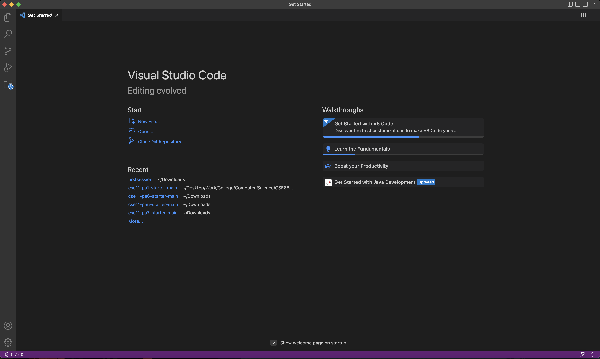
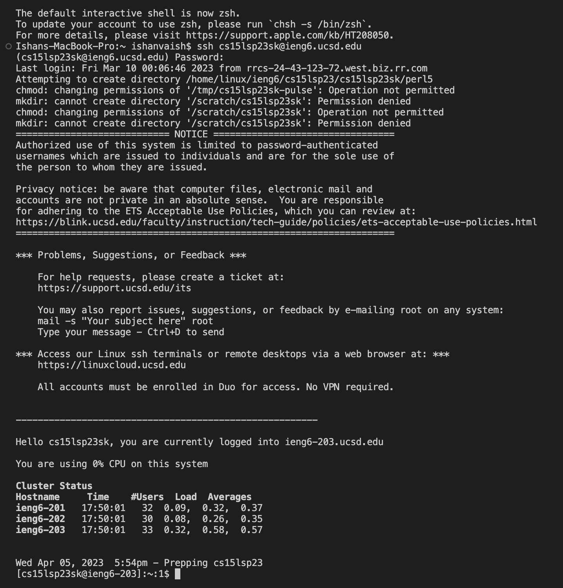
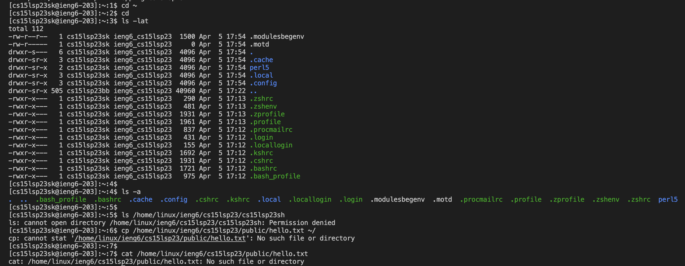

# Lab Report 1

**Tutorial for 15L students on how to log into a course-specific account on ieng6**

Step 1: Download VS Code

* First Step is to go to the website [Link](https://code.visualstudio.com) 
* Click on the big blue **Download** on the top right side of the screen
* Download the correct version of the VS code for your operating system
* After setting up VS code..your VS code should open up like in the photo above.

Step 2: Password Change of course-specific account

* First step is to go the website [Link](https://sdacs.ucsd.edu/~icc/index.php)
* Type in your username and PID
* Select your 15L account and then change your passcode

Step 3: Remotely Connecting (After changing your passcode)

* Type *$ ssh cs15lsp23zz@ieng6.ucsd.edu* command into your terminal **Ensure that you replace zz in the command with the letters in your course-specific username**
* Since it is your first time connecting, it will give you a sort of weird message...say **YES** to it (Explanation for this message can be found here [Link](https://superuser.com/questions/421074/ssh-the-authenticity-of-host-host-cant-be-established/421084#421084)
* Type in your passcode that you entered in Step 2.
* You should then get a message as shown in the screen shot above!

Step 4: Running some commands!!!

