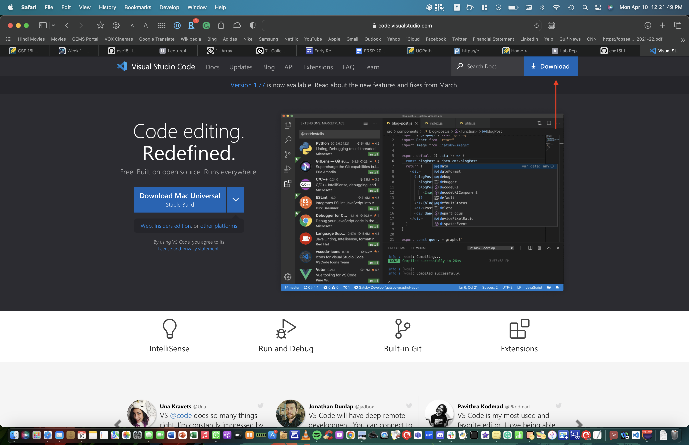

# Lab Report 1

**Tutorial for 15L students on how to log into a course-specific account on ieng6**

Step 1: Download VS Code


* First Step is to go to the website: [Link](https://code.visualstudio.com) 
* Click on the big blue **Download** button on the top right side of the screen



* Download the correct version of the VS code for your operating system.


* After setting up VS code., it should open up like in the photo above.

Step 2: Password Change of course-specific account

* First step is to go the website: [Link](https://sdacs.ucsd.edu/~icc/index.php).
* Type in your username and PID.
* Select your 15L account and then change your passcode.

Step 3: Remotely Connecting (After changing your passcode)


* In the terminal, type the command: 

    ```
    $ ssh cs15lsp23zz@ieng6.ucsd.edu
    ```
**(Make sure to replace the "zz" with your own course specific acount.)**
* This will most likely be your first time connecting to this server so you will see a message similar to this. If so, when asked if you would like to continue, enter **YES**

    ```
    The authenticity of host 'ieng6.ucsd.edu (128.54.70.227)' can't be established.
    
    Are you sure you want to continue connecting (yes/no/[fingerprint])?
    ```
(Explanation for this message can be found here [Link](https://superuser.com/questions/421074/ssh-the-authenticity-of-host-host-cant-be-established/421084#421084)

* Next, type in your passcode that you entered in Step 2.
* You should then get a message as shown in the screen shot above!

Step 4: Running some commands!!!


**Here are some commands to play around with!**

```
$ pwd //prints path to home directory
$ cd //changes directory
$ cd.. //goes back on directory
$ ls //lists what's inside the directory
$ ls -at //lists file names in directory
$ ls -lat //lists of files in directory in most recent order
$ cp //copies a file or directory
$ cat //displays what's in the file
```

**End of Tutorial**

For any questions, email ivaish@ucsd.edu
