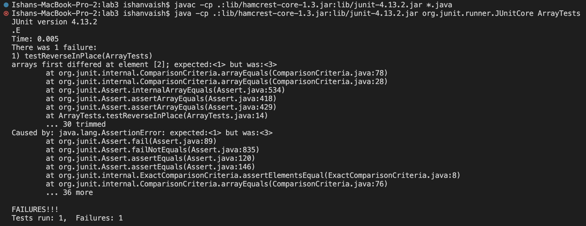

**Part 1**

***

**Part 2**

* Buggy Program: ArrayExamples.java
* Method: reverseInPlace

```
  static void reverseInPlace(int[] arr) {
    for(int i = 0; i < arr.length; i += 1) {
      arr[i] = arr[arr.length - i - 1];
    }
  }
```


* Input that doesn’t induce a failure:

```
	@Test 
	public void testReverseInPlace() {
    int[] input1 = { 3 };
    ArrayExamples.reverseInPlace(input1);
    assertArrayEquals(new int[]{ 3 }, input1);
```

* Failure-inducing input:

```
    int[] input2 = {1,2,3};
    ArrayExamples.reverseInPlace(input2);
    assertArrayEquals(new int[]{3,2,1}, input2);
	}
```
* The SYMPTOM:



* Before Code (Bug):

```
  static void reverseInPlace(int[] arr) {
    for(int i = 0; i < arr.length; i += 1) {
      arr[i] = arr[arr.length - i - 1];
    }
  }
```

* After Code (No Bug):
```
  static void reverseInPlacefixed(int[] arr) {
    for(int i = 0; i < arr.length/2; i += 1) {
      int t = arr[i];
      arr[i] = arr[arr.length - i - 1];
      arr[arr.length - i - 1] = t;
    }
  }
```

In the buggy code, we are unable the reverse the second half of the list because the logic of the code changes the first element in the list and iterates through the entire list. This doesn't allow us to reverse the last element of the list. The above code fixes this issue because it creates a variable t which allows us to store the element we want to reverse at the correct index. Moreover, we only iterate through half the list to ensure all elements get reversed.

***

**Part 3**

Something I learnt and found really interesting was creating and working with our very own servers in Lab 2. I use URL's and access online servers all the time but I have never actually taken the time to understand how each specific URL commands can be used to do different things. Trying to understand the code behind how ther server we ran worked and messing around with different commands was quite riveting. In Lab 3, I liked the way we went about testing. The process of understanding various codes, testing them with different inputs and then fixing them was a challenging yet rewarding process. It helped me understand how ArrayLists and LinkedLists work more thoroughly.


