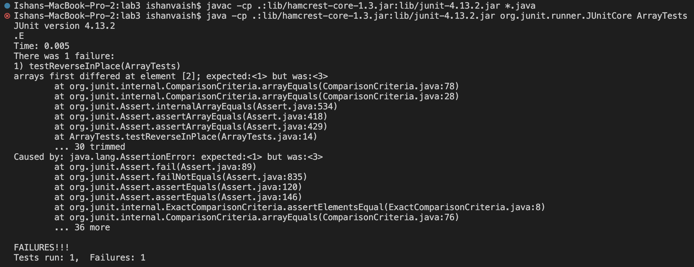

**Part 1**

***

**Part 2**

* Buggy Program: ArrayExamples.java
* Method: reverseInPlace

```
  static void reverseInPlace(int[] arr) {
    for(int i = 0; i < arr.length; i += 1) {
      arr[i] = arr[arr.length - i - 1];
    }
  }
```


* Input that doesn’t induce a failure:

```
	@Test 
	public void testReverseInPlace() {
    int[] input1 = { 3 };
    ArrayExamples.reverseInPlace(input1);
    assertArrayEquals(new int[]{ 3 }, input1);
```

* Failure-inducing input:

```
    int[] input2 = {1,2,3};
    ArrayExamples.reverseInPlace(input2);
    assertArrayEquals(new int[]{3,2,1}, input2);
	}
```
* The SYMPTOM:



* Before Code (Bug):

```
  static void reverseInPlace(int[] arr) {
    for(int i = 0; i < arr.length; i += 1) {
      arr[i] = arr[arr.length - i - 1];
    }
  }
```

* After Code (No Bug):
```
  static void reverseInPlacefixed(int[] arr) {
    for(int i = 0; i < arr.length; i += 1) {
      int t = arr[i];
      arr[i] = arr[arr.length - i - 1];
      arr[arr.length - i - 1] = t;
    }
  }
```


***

**Part 3**


