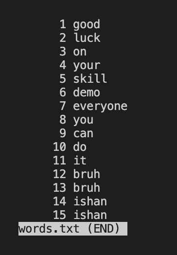

## less -N [File Name]

**What does it do?**

-N gives the line numbers in the less command output.

**How does it help?**

This is extremely helpful to reference certain lines in the file, because you no longer have to count each line manually.

**Example 1**

Input 1:

```
Ishans-MacBook-Pro-2:stringsearch ishanvaish$ less -N words.txt

```

Output 1:



**Example 2**

Input 2:

```
Ishans-MacBook-Pro-2:technical ishanvaish$ less -N 911report/chapter-1.txt

```

Output 2:


## less -p [String] [File path]

**What does it do?**

Highlights any occurence of the string you passed within the given file. 

**How does it help?**

It's useful when trying to find if a certain string exits in a file and also to find where it's located.

**Example 1**

Input 1:

```
Ishans-MacBook-Pro-2:technical ishanvaish$ less -p Boston 911report/chapter-1.txt

```

Output 1:


Input 2:

```
Ishans-MacBook-Pro-2:technical ishanvaish$ less -p but 911report/chapter-2.txt
```

Output 2:


  
