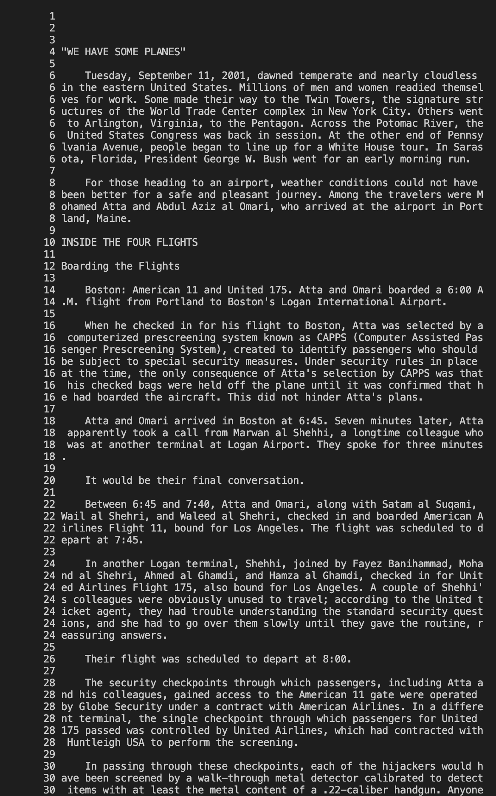

## less -N [File Name]

**What does it do?**

-N gives the line numbers in the less command output.

**How does it help?**

This is extremely helpful to reference certain lines in the file, because you no longer have to count each line manually.

**Example 1**

Input 1:

```
Ishans-MacBook-Pro-2:stringsearch ishanvaish$ less -N words.txt

```

Output 1:


**Example 2**

Input 2:

```
Ishans-MacBook-Pro-2:technical ishanvaish$ less -N 911report/chapter-1.txt

```

Output 2:



* Source: Website - https://linuxize.com/post/less-command-in-linux/

## less -p [String] [File path]

**What does it do?**

Highlights any occurence of the string you passed within the given file. 

**How does it help?**

It's useful when trying to find if a certain string exits in a file and also to find where it's located.

**Example 1**

Input 1:

```
Ishans-MacBook-Pro-2:technical ishanvaish$ less -p Boston 911report/chapter-1.txt

```

Output 1:


Input 2:

```
Ishans-MacBook-Pro-2:technical ishanvaish$ less -p but 911report/chapter-2.txt
```

Output 2:


* Source: Website - https://phoenixnap.com/kb/less-command-in-linux

## less -X [File path]

**What does it do?**

Leaves the contents of the file in the terminal after exiting.

**How does it help?**

Useful for when you need to reference back to something in the file when you are in the terminal. 

**Example 1**

Input 1:

```
Ishans-MacBook-Pro-2:technical ishanvaish$ less -X 911report/chapter-1.txt

```

Output 1:


Input 2:

```
Ishans-MacBook-Pro-2:technical ishanvaish$ less -X 911report/chapter-2.txt

```

Output 2:


* Source - ChatGPT

## less -X [File path]

**What does it do?**

It squeezes multiple blank lines from a text file into one blank line.

**How does it help?**

Removing multiple blank lines allows less to show more content.

**Example 1**

Input 1:

```
Ishans-MacBook-Pro-2:stringsearch ishanvaish$ less -s words.txt

```

Output 1:


Input 2:

```
Ishans-MacBook-Pro-2:stringsearch ishanvaish$ less -s words3.txt

```

Output 2:


* Source - ChatGPT
  
