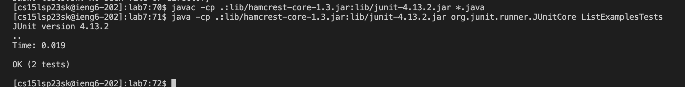
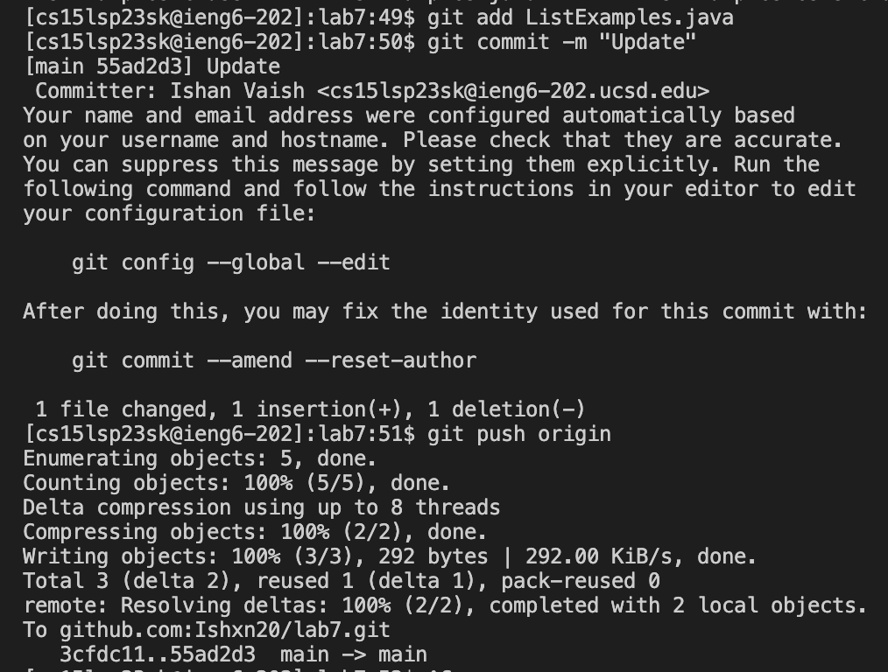

*Note: Steps 1-3 are not covered in this lab report*

## Step 4: Logging into ieng6 account


1. To login into my ieng6 account, I pressed *```<up><up>``` to reach the ```ssh cs15lsp23sk@ieng6.ucsd.edu``` command as it was 2 up in the search history, so I used up arrow to access it. Then, I pressed *```<enter>```*  to execute the command.
2. I didn't have to type in my password as I have configured my account using the SSH keys.

## Step 5: Cloning my fork of the repository from my Github account


1. I used ```<Command-C><Command-V>``` to use the ```git clone https://github.com/Ishxn20/lab7``` command to clone the fork and then pressed *```<enter>```*  to execute the command.

## Step 6: Demonstrating that the tests fail


1. I used the ```ls``` command to see all the directories and executed the command by pressing *```<enter>```*.
2. I then used the ```cd``` command to switch into the lab7 directory and executed the command by pressing *```<enter>```*.
3. I then used the ```pwd``` command to check if I am in the correct directory and executed the command by pressing *```<enter>```*.
4. I then used the ```ls``` command to see all the files and executed the command by pressing *```<enter>```*.
5. Lastly, I used the command ```bash test.sh``` to run the tests for the ListExamples.java file and executed the command by pressing *```<enter>```*.

## Step 7: Editing the code file


1. I used the ```vim ListExamples.java``` to allow me to edit the file.
2. I then pressed *```<I>```* to switch from normal mode into insert mode.
3. I located the error and pressed *```<37j>```* to move the cursor down 37 times to line with the incorrect code and made the necessary changes by pressing *```<Delete><2>```.
4. I switched back to normal mode by pressing *```<esc>```*  and saved changes by pressing *```<:wq>```*.

## Step 8: Demonstrating that the tests succeed



1. I used ```<Command-C><Command-V>``` for the ```javac -cp .:lib/hamcrest-core-1.3.jar:lib/junit-4.13.2.jar *.java``` command and then pressed *```<enter>```*. This creates a class file.
2. Then, I used ```<Command-C><Command-V>``` for the ```java -cp .:lib/hamcrest-core-1.3.jar:lib/junit-4.13.2.jar org.junit.runner.JUnitCore ListExamplesTests``` command to run that file.

## Step 9: Commit and Push



1. I used the ```git add``` command to add changes in the working directory and executed the command by pressing *```<enter>```*.
2. I used the ```git commit -m "update"``` command to records changes and executed the command by pressing *```<enter>```*.
3. I used the ```git push origin``` command to upload the local repository content to a remote repository and executed the command by pressing *```<enter>```*.
