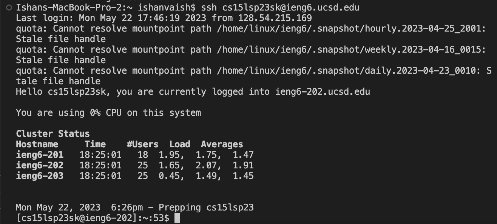
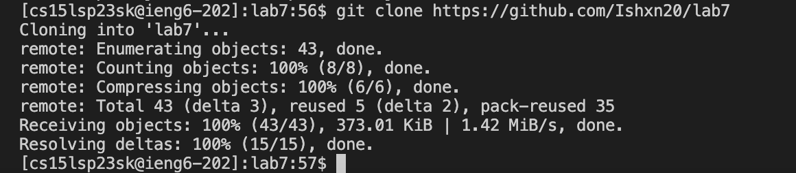
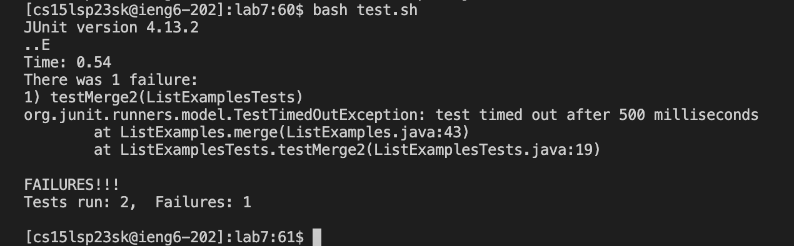
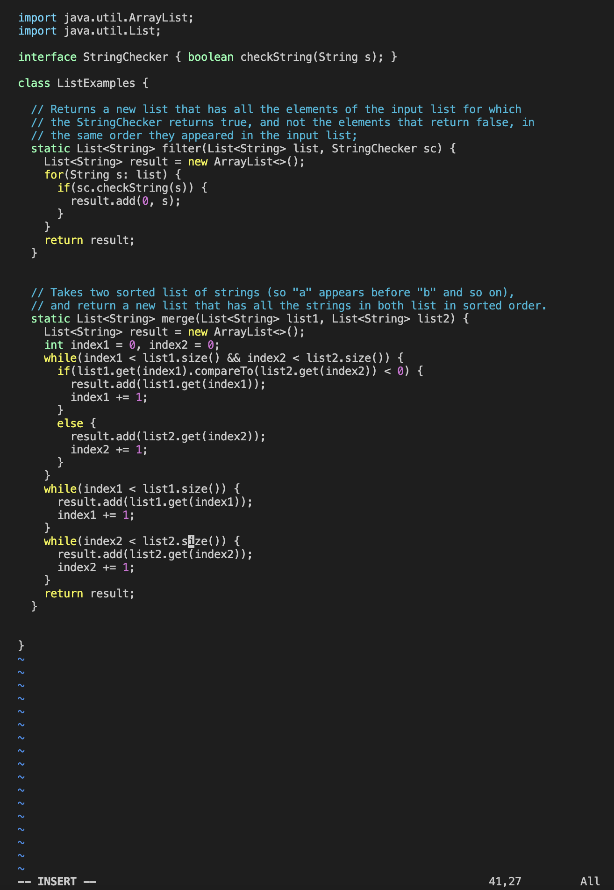

*Note: Steps 1-3 are not covered in this lab report*

## Step 4: Logging into ieng6 account



* I used the command ```ssh cs15lsp23sk@ieng6.ucsd.edu``` to login into my ieng6 account.
* I didn't have to type in my password as I have configured my account using the SSH keys.

Exact keys pressed (in order)

1. *```<up><up>```* (Used to move to the command for ieng6)
2. *```<enter>```* (Executes the command)

## Step 5: Cloning my fork of the repository from my Github account



* I used the command ```git clone https://github.com/ucsd-cse15l-s23/lab7``` to clone the fork.

Exact keys pressed (in order)

1. *```<Command-C><Command-V>```* (Copy-pasted the link for the fork)
2. *```<enter>```* (Executes the command)

## Step 6: Demonstrating that the tests fail




* I used the ```ls``` command to see all the directories.
* I then used the ```cd``` command to switch into the lab7 directory.
* I used the command ```bash test.sh``` to run the tests for the ListExamples.java file.

Exact keys pressed (in order)

1. *```<enter>```* (Executes the command)
2. *```<enter>```* (Executes the command)
3. *```<enter>```* (Executes the command)

## Step 7: Editing the code file



* I used the ```vim ListExamples.java``` to allow me to edit the file.
* I then used the ```cd``` command to switch into the lab7 directory.
* I used the command ```bash test.sh``` to run the tests for the ListExamples.java file.

Exact keys pressed (in order)

1. *```<I>```* (Switch from normal mode to insert mode)
2. *```37j```* (Moves cursor to cursor down 37 times)
3. *```<enter>```* (Executes the command)

## Step 7: Demonstrating that the tests fail


