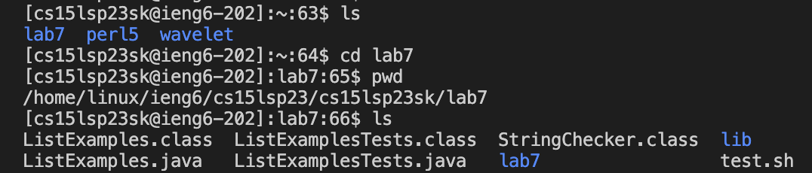

*Note: Steps 1-3 are not covered in this lab report*

## Step 4: Logging into ieng6 account


* I used the command ```ssh cs15lsp23sk@ieng6.ucsd.edu``` to login into my ieng6 account.
* I didn't have to type in my password as I have configured my account using the SSH keys.

Exact keys pressed (in order)

1. *```<up><up>```* (Used to move to the command for ieng6)
2. *```<enter>```* (Executes the command)

## Step 5: Cloning my fork of the repository from my Github account


* I used the command ```git clone https://github.com/Ishxn20/lab7``` to clone the fork.

Exact keys pressed (in order)

1. *```<Command-C><Command-V>```* (Copy-pasted the link for the fork)
2. *```<enter>```* (Executes the command)

## Step 6: Demonstrating that the tests fail




* I used the ```ls``` command to see all the directories.
* I then used the ```cd``` command to switch into the lab7 directory.
* I then used the ```pwd``` command to check if I am in the correct directory.
* I then used the ```ls``` command to see all the files.
* Lastly, I used the command ```bash test.sh``` to run the tests for the ListExamples.java file.

Exact keys pressed (in order)

1. *```<enter>```* (Executes the command)
2. *```<enter>```* (Executes the command)
3. *```<enter>```* (Executes the command)
4. *```<enter>```* (Executes the command)
5. *```<enter>```* (Executes the command)

## Step 7: Editing the code file


* I used the ```vim ListExamples.java``` to allow me to edit the file.
* I then went into edit mode.
* I located the error and made the necessary change. (*changed index1 --> index2*)
* I saved the file 

Exact keys pressed (in order)

1. *```<I>```* (Switches from normal mode to insert mode)
2. *```<37j>```* (Moves cursor to cursor down 37 times to line with the incorrect code)
3. *```<Delete><2>```* (index1 --> index2)
4. *```<esc>```* (Switches back to normal mode)
5. *```<:wq>```* (Save changes)

## Step 8: Demonstrating that the tests succeed


* I used the ```javac -cp .:lib/hamcrest-core-1.3.jar:lib/junit-4.13.2.jar *.java``` command to create the class file.
* Then, I used```java -cp .:lib/hamcrest-core-1.3.jar:lib/junit-4.13.2.jar org.junit.runner.JUnitCore ListExamplesTests``` command to run that file.

Exact keys pressed (in order)

1. *```<Command-C><Command-V>```* (Copy-pasted the command)
2. *```<enter>```* (Executes the command)
4. *```<Command-C><Command-V>```* (Copy-pasted the command)
5. *```<enter>```* (Executes the command)

## Step 9: Commit and Push


* I used the ```git add``` to add changes in the working directory.
* I used the ```git commit -m "update"``` to records changes.
* I used the ```git push origin``` to upload the local repository content to a remote repository.

Exact keys pressed (in order)

1. *```<enter>```* (Executes the command)
2. *```<enter>```* (Executes the command)
3. *```<enter>```* (Executes the command)


