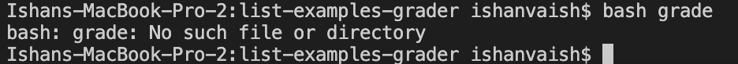
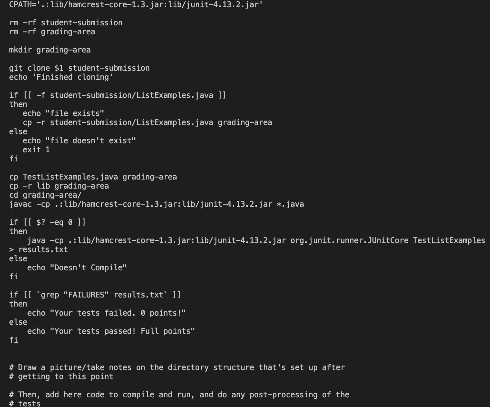
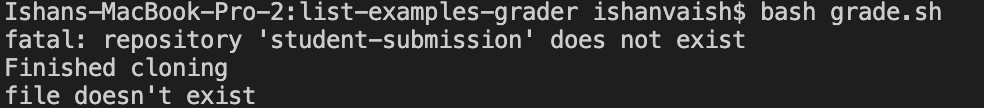
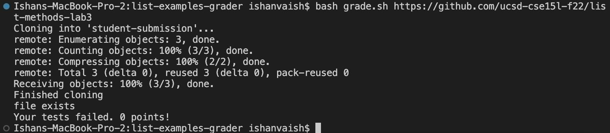

# Part 1 – Debugging Scenario

## What environment are you using (computer, operating system, web browser, terminal/editor, and so on)?

Computer: Macbook Pro 

Operating System: Ventura 13.0.1

Terminal: VS code & Bash.

## Detail the symptom you're seeing. Be specific; include both what you're seeing and what you expected to see instead. Screenshots are great, copy-pasted terminal output is also great. Avoid saying “it doesn't work”.

I'm unable to run the list-examples-grader bash script to test my code.

It's producing the error: ```bash: grade: No such file or directory```



## Detail the failure-inducing input and context. That might mean any or all of the command you're running, a test case, command-line arguments, working directory, even the last few commands you ran. Do your best to provide as much context as you can.

I'm including the bash keyword before the bash script file. I'm really confused as to what is going wrong :(

I believe the code inside the bash script is correct.



## TA Response:

I understand your problem and frustration. You code in the grade.sh file seems to be correct. I believe you are making a very minor mistake.

Even though your including the correct keyword ```bash```, you miss the file extension causing the bash script to not run!

Hope this helps!

## What Happened after TA's response?

Unfortunately, my code still isn't working. I'm running into a different problem now. On analyzing the error, it says that I'm missing some file.



But from this photo, you can clearly see that I have included the grade.sh file. I don't understand what the problem is :(

# The Error

This link should give more insight into your error: [Link](https://ucsd-cse15l-s23.github.io/week/week6/)

Do you notice anything different about what you have and what is there?

Even though your syntax is correct now, your missing a repository that would have a java file that your bash script would run its tests on.

The link provided above has a bunch of sample repositories you could try out and experiment with!

Remember the full syntax would be ```bash grade.sh https://github.com/some-username/some-repo-name```

Your sample output would like this:



# Part 2 – Reflection

I learned how to design and implement algorithms to solve complex problems efficiently, gaining hands-on experience with data structures, software development, debugging, coding practices, and optimization techniques. Additionally, I discovered new  coding languages such as bash and vim. For me, the most interesting part of the course was tryiing to make servers from scatch and trying to create our very own autograders. Overall, it was a fun experience as I not only met new people who I became great friends with I also learned a lot about the various emerging technologies such as ChatGPT. 
