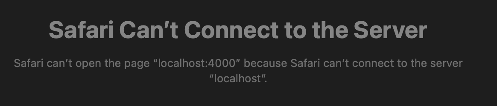
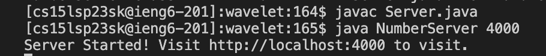
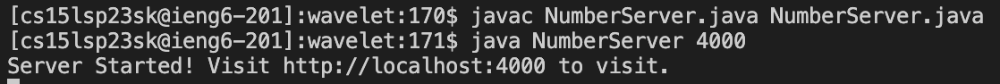
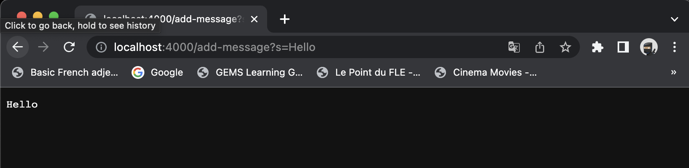

# Part 1 – Debugging Scenario

## What environment are you using (computer, operating system, web browser, terminal/editor, and so on)?

Computer: Macbook Pro 

Terminal: VS code

## Detail the symptom you're seeing. Be specific; include both what you're seeing and what you expected to see instead. Screenshots are great, copy-pasted terminal output is also great. Avoid saying “it doesn't work”.

I'm unable to open the server on my web browser despite succesfully starting it on my terminal.

## Detail the failure-inducing input and context. That might mean any or all of the command you're running, a test case, command-line arguments, working directory, even the last few commands you ran. Do your best to provide as much context as you can.

On opening the link for my server, I'm constantly getting this error.

## TA Response:

I understand your problem. You are making a very common mistake.

Look at for exact command used to run a server at this link: 

Do you notice anything different about what you have and what is there?

## What Happened after TA's response?

In the link provided, I noticed that I was simply missing the NumberServer.java at the end of your java command.

If didn't think that the server is unable to start if I didn't included this file.

## Server successfully starting

# Part 2 – Reflection

I learned how to design and implement algorithms to solve complex problems efficiently, gaining hands-on experience with data structures, software development, debugging, coding practices, and optimization techniques. Additionally, I discovered new  coding languages such as bash and vim. For me, the most interesting part of the course was tryiing to make servers from scatch and trying to create our very own autograders. Overall, it was a fun experience as I not only met new people who I became great friends with I also learned a lot about the various emerging technologies such as ChatGPT. 
